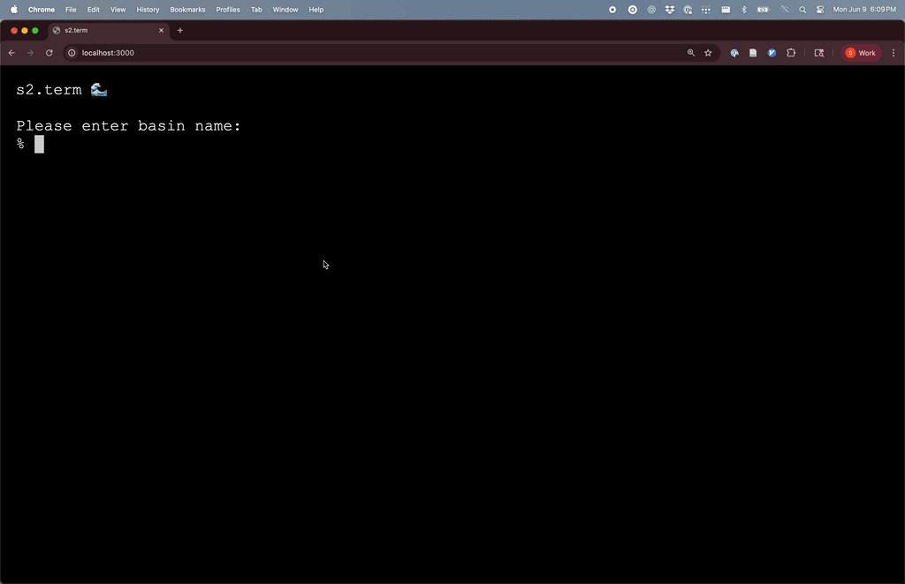

# s2.term

Demo of a durable, log-structured [pseudo-terminal](https://en.wikipedia.org/wiki/Pseudoterminal) implemented over [S2](https://s2.dev) streams.

(See also the [blog post](https://s2.dev/blog/s2-term) about this.)



## About

This repo is meant to serve as a proof-of-concept. Please use at your own risk!

It's kinda like a remote shell, e.g. SSH, but:
- Multiplayer, including from browsers. Useful for pair-programming.
- All terminal updates are durable on object-storage before delivery.
- All updates can be replayed ([example](https://www.youtube.com/watch?v=huyhEe5CLcU)); old state can be [periodically trimmed](https://s2.dev/docs/stream#retention).
- No servers necessary, all I/O happens by reading or appending to the S2 API.
- Configurable with [ACLs](https://s2.dev/docs/access-control).
  - For example, can configure roles to grant read-only access to terminal viewers, and read-write to others.

## Organization

There are two components in this repo currently:
- An [xterm.js](https://xtermjs.org/) based frontend (`ts-frontend`), which can be run locally, or deployed on any web server.
  - This interacts with S2 streams via the [S2 Typescript SDK](https://github.com/s2-streamstore/s2-sdk-typescript).
- A Rust binary that acts as PTY (`rust-pty-host`), which will run on the remote host where you want a shell.
  - This is built with [pty_process](https://docs.rs/pty-process/latest/pty_process/) crate, and the [S2 Rust SDK](https://github.com/s2-streamstore/s2-sdk-rust).

## Running it 

### S2 Setup 

First, head to [S2.dev](https://s2.dev/) and create an account and token if you haven't already.

> [!IMPORTANT]
> If you plan on sharing access to your terminal with others, make sure to create dedicated (and limited) tokens [with appropriate scopes](https://s2.dev/docs/access-control). These can be revoked at anytime via the [S2 dashboard](https://s2.dev/dashboard).

#### Organization 

Each terminal "session" requires two S2 streams. This setup assumes an organization like the following:

```bash
s2://${MY_BASIN}/sessions/${MY_SESSION}/term_input
s2://${MY_BASIN}/sessions/${MY_SESSION}/term_output
```

For example, my basin looks like this:
```console
% s2 ls s2term-00001
s2://s2term-00001/sessions/0001/term_input 2025-06-06T22:03:22Z
s2://s2term-00001/sessions/0001/term_output 2025-06-06T22:03:26Z
s2://s2term-00001/sessions/0002/term_input 2025-06-06T22:33:26Z
s2://s2term-00001/sessions/0002/term_output 2025-06-06T22:33:31Z
s2://s2term-00001/sessions/0003/term_input 2025-06-06T22:51:30Z
s2://s2term-00001/sessions/0003/term_output 2025-06-06T22:51:34Z
s2://s2term-00001/sessions/0004/term_input 2025-06-09T21:37:57Z
s2://s2term-00001/sessions/0004/term_output 2025-06-09T21:39:00Z
```

#### Create necessary streams

This can be done using the [S2 CLI](https://s2.dev/docs/quickstart).

```bash
export MY_ACCESS_TOKEN="<access token>"
export MY_BASIN="s2term-00001"
export MY_SESSION="0001"

# input stream
s2 create-stream \
  s2://${MY_BASIN}/sessions/${MY_SESSION}/term_input \
  --storage-class express \
  --timestamping-mode client-require

# output stream
s2 create-stream \
  s2://${MY_BASIN}/sessions/${MY_SESSION}/term_output \
  --storage-class express \
  --timestamping-mode client-require
```

### Starting the Rust PTY

Make sure you [have Rust installed](https://rustup.rs/).

Start the process with `cargo`. In the example below, we will manage a PTY (over a `zsh` shell, though you can use any process you like) for a single session.
```bash
export S2_ACCESS_TOKEN="<access token>"
export RUST_LOG=info
cargo run --release -- \
  "${MY_BASIN}" \
  "${MY_SESSION}" \
    --process zsh 
```

You can toggle trace-level logs with `RUST_LOG=info,s2term_pty_host=trace`.

#### Running the PTY via Docker 

Alternatively, run the PTY via a Docker container for some additional security.

```bash
docker build -t s2term-pty-host .
docker run \
  -e "S2_ACCESS_TOKEN=${S2_ACCESS_TOKEN}" \
  s2term-pty-host \
    "${MY_BASIN}" \
    "${MY_SESSION}" \
      --process zsh 
```

### Starting the frontend

Install [Node.js](https://nodejs.org/en/download).

Then you can install the frontend with:
```bash
cd ./ts-frontend
npm install
```

... and run a local dev server with
```bash
npm run dev
```

You should be able to see the site running at `http://localhost:3000`.

By default, the xterm div will start by interactively prompting for basin, session, and token. These can be provided also via query params, e.g.:

```
http://localhost:3000/?basin=s2term-00001&session=0001&token=MY_TOKEN
```

Similarly, some other query params:
- `since=EPOCH_MS`
  - If an epoch timestamp in ms is provided, the session will attempt to replay from messages starting at that moment.
- `speedup=MULTIPLE`
  - In combination with a `since` timestamp, this factor controls how long to wait between records when replaying historical messages. E.g. `speedup=60` would advance time at a rate of 1 min per second.
